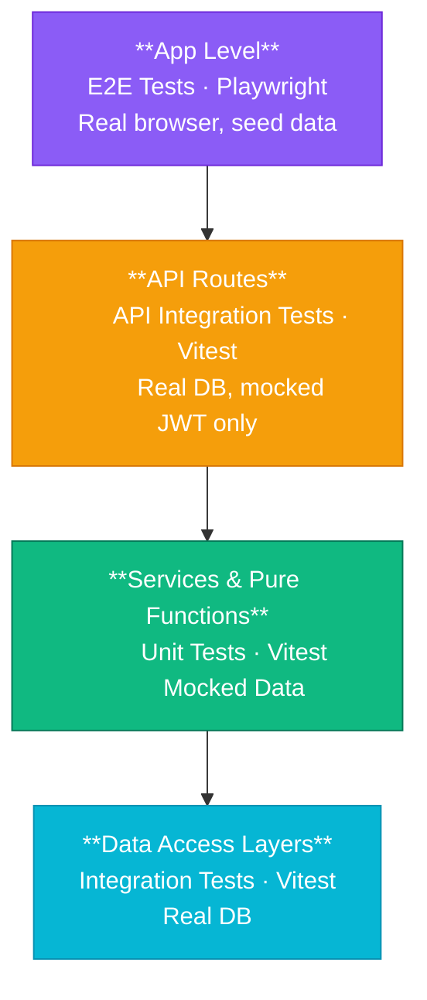

# Testing Conventions

## The Pyramid

> **Top → Bottom = E2E → Integration.** The API layer mocks only JWT verification — everything else (services, DAL, DB) runs real.

## Four Rules

1. **Data-access functions** hit a real Supabase instance. No mocking. This is the contract between our app and the database — if it's wrong, we need to know.

2. **API routes** mock only `authenticateFromRequest()` (JWT verification). Authorization, validation, services, and DAL all run real against a seeded database. See [API Integration Testing](./4-api-testing/1-api-integration-tests.md).

3. **Services** mock their data-access imports. We're testing orchestration logic (validation, branching, error handling), not re-testing the queries.

4. **Pure functions** don't mock anything. Data in, data out.

## Reading Order

| #   | File                                                                                       | What You'll Learn                                    |
| --- | ------------------------------------------------------------------------------------------ | ---------------------------------------------------- |
| 1   | **You are here**                                                                           | The testing pyramid and core rules                   |
| 2   | [Vitest Config](./2-vitest-config.md)                                                      | Config files, NPM scripts, env vars, CI workflows    |
| 3   | [Shared Infrastructure](./3-shared-infrastructure.md)                                      | Setup file, factories, mocks, integration helpers    |
| 4   | [Unit Testing](./1-unit-testing/1-unit-tests.md)                                           | What gets unit tested and why                        |
| 5   | [Factories & Mocking](./1-unit-testing/2-factories-and-mocking.md)                         | Data factories and `vi.mock()` patterns              |
| 6   | [Writing Unit Tests](./1-unit-testing/3-writing-unit-tests.md)                             | File placement, test structure, conventions          |
| 7   | [Unit Test Best Practices](./1-unit-testing/4-unit-test-best-practices.md)                 | Mocking discipline, what not to test, error paths    |
| 8   | [Integration Testing](./2-integration-testing/1-integration-tests.md)                      | What gets integration tested and why                 |
| 9   | [Seed Functions](./2-integration-testing/2-shared-seed-functions.md)                       | How seed/cleanup helpers work                        |
| 10  | [Writing Integration Tests](./2-integration-testing/3-writing-integration-tests.md)        | File placement, test structure, conventions          |
| 11  | [Integration Best Practices](./2-integration-testing/4-integration-test-best-practices.md) | Isolation, assertions, anti-patterns, cleanup        |
| 12  | [API Integration Testing](./4-api-testing/1-api-integration-tests.md)                      | What gets API tested, mock boundary, updated pyramid |
| 13  | [Auth Helpers](./4-api-testing/2-auth-helpers.md)                                          | Auth mocking strategy and helper functions           |
| 14  | [Writing API Tests](./4-api-testing/3-writing-api-tests.md)                                | File placement, request builders, test structure     |
| 15  | [API Test Best Practices](./4-api-testing/4-api-test-best-practices.md)                    | Isolation, assertions, migration, anti-patterns      |
| 16  | [General Best Practices](./4-general-best-practices.md)                                    | AAA pattern, naming, assertions, readability         |
| 17  | [E2E Testing](./3-e2e-testing/1-e2e-tests.md)                                              | What gets e2e tested and why                         |
| 18  | [E2E Project Structure](./3-e2e-testing/2-project-structure.md)                            | Directory layout, seed+spec pairs, file naming       |
| 19  | [Global Lifecycle](./3-e2e-testing/3-global-lifecycle.md)                                  | Global setup/teardown, manifest system, concurrency  |
| 20  | [Seed System](./3-e2e-testing/4-seed-system.md)                                            | Seed builders, SpecSeed interface, API helpers       |
| 21  | [E2E Authentication](./3-e2e-testing/5-authentication.md)                                  | Headless auth, storageState, multi-user              |
| 22  | [Page Objects & Fixtures](./3-e2e-testing/6-page-objects-and-fixtures.md)                  | POM pattern, locators, navigation helper             |
| 23  | [Writing E2E Tests](./3-e2e-testing/7-writing-e2e-tests.md)                                | Test structure, manifest, assertions, cleanup        |
| 24  | [E2E Best Practices](./3-e2e-testing/8-best-practices.md)                                  | Anti-patterns, flakiness, debugging                  |
| 25  | [Playwright Docs Index](./3-e2e-testing/9-playwright-docs-index.md)                        | Reference index for Playwright documentation         |
