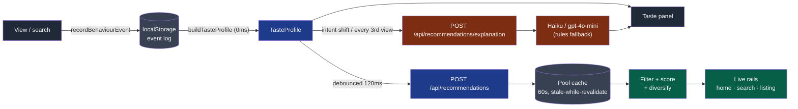

# Live Recommendation Engine

## Overview

A **behaviour-driven recommendation engine** for spare parts that re-ranks suggestions within milliseconds of every action. Open 2–3 Toyota Corolla parts and every "Picked for you" rail turns Corolla. Search "corolla" under Rs 2,000 and every suggestion drops into that range. It works for **guests** too: no sign-in needed.

It sits alongside the existing pgvector "Similar parts" rail on the listing page, which is unchanged.

## System Design & Architecture

### One model per trigger

| Trigger | Engine | Latency | Why |
| --- | --- | --- | --- |
| View a part, search, set a price filter | Deterministic scorer, no LLM | **~1–3ms** server, ~5–10ms round trip | Runs on every click; must feel instant and never fail |
| Intent shift (new top vehicle / budget) or every 3rd view | **Claude Haiku** if `ANTHROPIC_API_KEY` is set, else **gpt-4o-mini** if `OPENAI_API_KEY` is set, else a rules sentence | ~1–3s, async | A one-sentence intent read needs a fast, cheap model |
| Chat questions | Existing ShopSmart chatbot | seconds | Multi-step reasoning |

### Signals

| Signal | Source | Score weight |
| --- | --- | --- |
| **Vehicle** ("Toyota Corolla") | `details.brand`, else detected from the title or search text | 10 × share |
| **Part type** ("Brake Pads") | `details.part_type`, else detected from the title or search text | 6 × share |
| **Budget** | price filter = hard range; viewed prices = soft ±25% band | up to 4 |
| **Condition** | `listing_condition` (oem / aftermarket / used / refurbished) | 1.5 × share |
| Freshness / stock | listed < 7 days / stock ≥ 5 | +0.5 / +0.3 |

Newest events count most (×1, ×0.75, ×0.56, …), so 2 Civic views followed by 2 Corolla views gives **Corolla 64%, Civic 36%**.

### Data flow



### Why a pool cache

The live database is about 400ms away per round trip, whatever the query size. The whole active catalogue, with card columns and **one** cover image per part, is about 300KB. So it is fetched once into server memory and refreshed in the background every 60 seconds. Scoring then runs over that copy, and decisions skip the database entirely. See [`live-recommendations.ts`](../src/lib/features/recommendations/services/live-recommendations.ts).

### Diversity

The catalogue has many identical titles from different sellers. The ranker therefore skips duplicate titles and shows at most **2 parts of the same type**, so the rail never shows four identical cards.

### Folder structure

```
src/lib/features/recommendations/
├── index.ts               # client barrel
├── types.ts · config.ts · schemas.ts
├── profile.ts             # events → TasteProfile, vehicle / part detection (pure)
├── store.ts               # localStorage event log + subscribe
├── hooks.ts               # useTasteProfile, useLiveRecommendations, useTasteExplanation
├── __tests__/             # profile, scoring, schema unit tests
└── services/              # server barrel (server-only)
    ├── _scoring.ts        # pure scorer
    ├── _data-access/      # pool query
    ├── live-recommendations.ts
    └── taste-explanation.ts
src/components/recommendations/   # rail, taste panel, trackers
src/app/api/recommendations/      # POST route.ts + explanation/route.ts
```

## Quick Start

```bash
npm ci --legacy-peer-deps
npm run build && npx next start -p 3202
```

> [!IMPORTANT]
> Present on a **production build** with the tab **in front**. Dev mode compiles on first visit, and background tabs pause rendering, so views get recorded late.

## Usage Example: demo script

1. Open `/`: the "Your taste" panel (bottom-left) is empty and the rail says "Trending parts".
2. Open 2 Honda Civic parts, then go home: "Picked for you · Live" shows Civic parts.
3. Open 2 Toyota Corolla parts, then go home: the rail flips to **Corolla** (panel: Corolla 64%, Civic 36%).
4. Search `corolla` with max price 2000: "Recommended for you" contains only parts **under Rs 2k**, with "hard filter" in the panel.
5. Point at the panel footer, "Decided in ~1ms · Vehicle-led", and the AI sentence.
6. Click **Reset** (↺) to start over.

## Config

| Variable | Purpose |
| --- | --- |
| `ANTHROPIC_API_KEY` | Uses Claude Haiku for the explanation sentence (preferred) |
| `OPENAI_API_KEY` | Fallback: gpt-4o-mini for the sentence |
| `RECS_EXPLANATION_MODEL` | Overrides the model id for whichever provider runs |
| `UPSTASH_REDIS_REST_URL` / `_TOKEN` | Rate limit for the explanation route (30/min/IP); open when unset |

Tunables (decay, weights, keywords, debounce) live in [`config.ts`](../src/lib/features/recommendations/config.ts).

## API

| Route | Body | Returns |
| --- | --- | --- |
| `POST /api/recommendations` | `{ profile, contextListingId?, limit? }` | `{ strategy, listings[+recommendation], decisionMs }` |
| `POST /api/recommendations/explanation` | `{ profile }` | `{ text, source: "ai" \| "rules", model }` |

Both routes are public. The profile is untrusted browser input, so Zod bounds every list and number. IDs use `z.guid()` because the seeded catalogue IDs (`c5000000-…`) fail Zod v4's strict `uuid()`.

## Contributing

- New vehicle or part type? Add it to `VEHICLE_KEYWORDS` / `PART_TYPE_KEYWORDS` in `config.ts`.
- Change weights in `config.ts`, then update the pinned expectations in `__tests__/`.
- Keep LLM calls off the per-click path.

## Related Docs

- Chatbot and pgvector search: `src/lib/features/chatbot`, `src/app/api/recommendations/similar`
